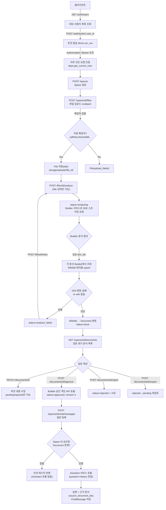
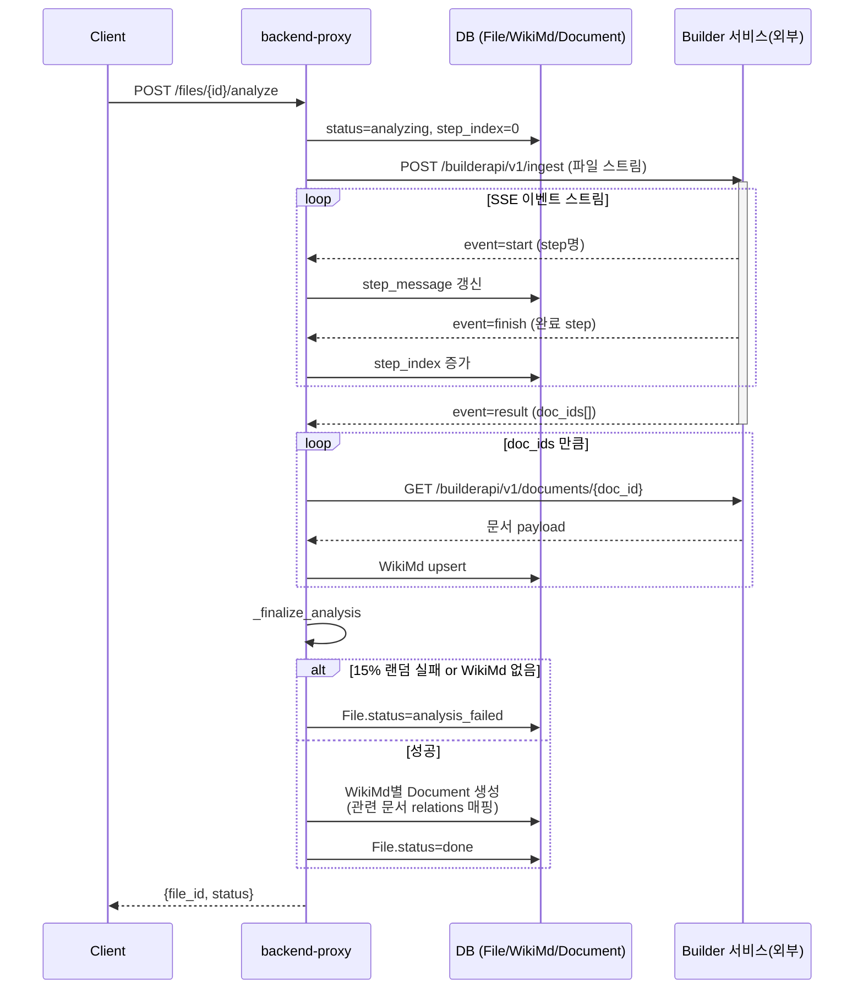

# Backend Proxy

Knowledge Space API (FastAPI + SQLAlchemy + PostgreSQL). 명세: [../docs/api-spec.md](../docs/api-spec.md)

## 실행 방법

1. 가상환경 활성화 (저장소 루트에 `.venv` 존재)

   ```bash
   source ../.venv/bin/activate
   ```

2. 의존성 설치

   ```bash
   pip install -r requirements.txt
   ```

3. `.env` 작성 (`backend-proxy/.env`)

   ```
   DATABASE_URL=postgresql://<user>:<password>@<host>:<port>/<db>
   ```

4. 서버 실행 (localhost:8000)

   ```bash
   uvicorn app.main:app --reload --host 127.0.0.1 --port 8000
   ```

5. 확인: http://localhost:8000/docs (Swagger UI)

서버 시작 시 테이블 자동 생성(`create_all`) 및 데모 사용자(`usr_hong`, `usr_lee`) 시딩이 수행됩니다.

## 업무 흐름도

### 전체 흐름 (인증 → Space → File → Document → Chat)



### 파일 분석 상세 시퀀스 (Builder 연동, SSE)



**핵심 포인트**

- **인증**: 실제 JWT가 아니라 `demo.<user_id>` 형태의 데모 토큰(`app/deps.py`).
- **분석은 동기 호출**: `/files/{id}/analyze`가 Builder 스트리밍 응답을 끝까지 기다린 후 응답하며(`app/routers/files.py`), 진행률은 SSE 이벤트마다 DB에 즉시 반영되어 폴링으로 확인 가능.
- **의도적 실패 주입**: `FAILURE_RATE=0.15`로 분석 완료 후에도 15% 확률로 실패 처리(`app/routers/files.py`) — 데모/테스트용 흔들기.
- **문서 승인 시 Builder에 재통보**: `approve`가 Builder의 `/documents/{wiki_doc_id}/approve`를 호출해 색인 상태를 동기화(`app/routers/documents.py`).
- **챗봇은 승인된 문서만 참조**: 승인 문서가 하나도 없으면 Assistant를 호출하지 않고 고정 안내 문구를 반환(`app/routers/chat.py`).


